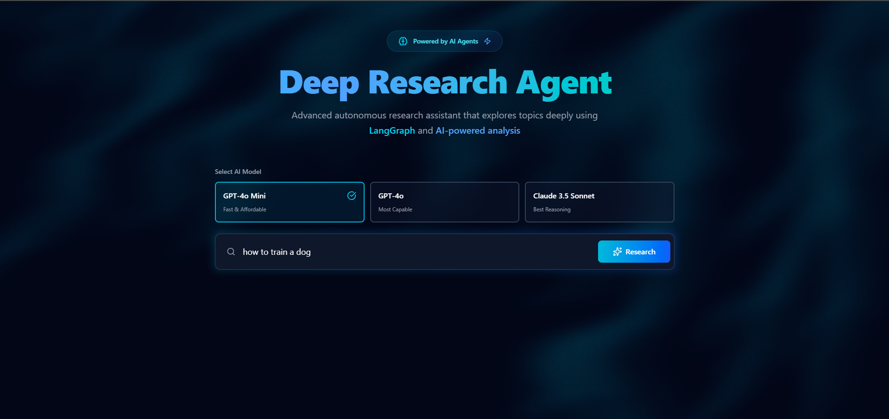

# 🕵️‍♂️ Deep Research Agent

 

An advanced autonomous AI agent that conducts deep, comprehensive research on any topic using **LangGraph** and **OpenRouter API**, with a beautiful modern web interface featuring real-time progress tracking and Perplexity-style UI.

---

## ✨ Features

### 🤖 **Intelligent Research**
- **Multi-iteration Research**: Agent performs multiple research cycles for comprehensive coverage
- **Smart Query Planning**: AI-generated search queries targeting different aspects of topics
- **Web Scraping**: Scrapes 10-20 websites for deep content analysis
- **Parallel Analysis**: Facts, trends, and insights analyzed simultaneously
- **Comprehensive Reports**: Well-structured, professional markdown with citations

### 🎨 **Modern UI (Perplexity-style)**
- **Real-time Progress**: Watch search queries, source scraping, and analysis steps
- **Working Indicator**: Live timer showing agent thinking time
- **Source Display**: Expandable list of websites being reviewed
- **Search Query Pills**: Visual tags showing active research queries
- **PDF Export**: Download reports with proper formatting (html2canvas)
- **Copy to Clipboard**: One-click copy entire report
- **Responsive Design**: Works on desktop, tablet, and mobile

### ⚡ **Technical Excellence**
- **Streaming Updates**: Server-Sent Events (SSE) for real-time communication
- **Dynamic Report Structure**: Adapts to "how-to" guides vs. market analysis
- **Strict Citation Requirements**: All claims sourced with inline citations
- **Error Handling**: Robust recovery and user-friendly error messages
- **Token Optimization**: Smart allocation to reduce API costs

---

## 🏗️ Tech Stack

### Frontend
- **React 18** + **TypeScript**
- **Vite** (build tool)
- **Tailwind CSS** (styling)
- **Framer Motion** (animations)
- **React Markdown** + **remark-gfm** (report rendering)
- **jsPDF** + **html2canvas** (PDF export)
- **Lucide React** (icons)

### Backend
- **FastAPI** (Python API)
- **LangGraph** (agent workflow)
- **LangChain** (LLM orchestration)
- **OpenRouter API** (multi-model support)
- **DuckDuckGo Search** (web search)
- **BeautifulSoup4** (web scraping)

---

## 🚀 Quick Start

### Prerequisites

- **Node.js 18+** & npm
- **Python 3.10+**
- **OpenRouter API Key** ([Get one here](https://openrouter.ai))

### 1. Clone & Setup Environment

```bash
# Clone repository
git clone https://github.com/Priyansh-Fanatic/deep_research_agent.git
cd deep_research_agent

# Create .env file in backend directory
cd backend
echo "OPENROUTER_API_KEY=your_api_key_here" > .env
```

### 2. Start Backend

```bash
# Install Python dependencies
pip install -r requirements.txt

# Run FastAPI server
uvicorn main:app --reload --host 0.0.0.0 --port 8000
```

✅ Backend is now running at `http://localhost:8000`  
📚 API docs available at `http://localhost:8000/docs`

### 3. Start Frontend

```bash
# In a new terminal
cd frontend

# Install dependencies
npm install

# Run development server
npm run dev
```

✅ Frontend is now running at `http://localhost:5173`

---

## 📂 Project Structure

```
deep_research_agent/
├── backend/                    # Python FastAPI Backend
│   ├── main.py                # FastAPI server with SSE
│   ├── agent/
│   │   ├── graph.py           # LangGraph workflow (planner, search, scrape, analyze, write)
│   │   ├── state.py           # Agent state TypedDict
│   │   ├── tools/
│   │   │   ├── search.py      # DuckDuckGo search (20 results)
│   │   │   └── browser.py     # Web scraping (BeautifulSoup4)
│   │   └── utils/
│   │       └── llm.py         # OpenRouter LLM configuration
│   ├── requirements.txt
│   ├── railway.toml           # Railway deployment config
│   └── .env                   # Environment variables (gitignored)
│
├── frontend/                   # React Frontend
│   ├── src/
│   │   ├── App.tsx            # Main UI with Perplexity-style progress
│   │   ├── components/
│   │   │   └── ui/
│   │   │       ├── text-shimmer.tsx    # Animated text component
│   │   │       └── etheral-shadow.tsx  # Background effect
│   │   ├── lib/
│   │   │   └── utils.ts       # cn() utility for class merging
│   │   ├── index.css          # Tailwind + custom animations
│   │   └── main.tsx
│   ├── vite.config.ts         # Vite configuration with path alias
│   ├── tsconfig.app.json      # TypeScript config with @/* paths
│   ├── tailwind.config.js
│   └── package.json
│
├── .gitignore                  # Git ignore rules
├── vercel.json                 # Vercel deployment config
└── README.md                   # This file
```

---

## 🎯 How It Works

The agent follows a **LangGraph workflow** with these nodes:

1. **📋 Planner** → Generates strategic search queries (detects "how-to" vs. "analysis" topics)
2. **🔍 Search** → Executes searches (20 results via DuckDuckGo)
3. **📄 Scrape** → Scrapes 15 websites for full content
4. **🧠 Analyze (Parallel)** → 3 parallel nodes:
   - `analyze_facts` → Extracts verified statistics & data
   - `analyze_trends` → Identifies patterns & developments
   - `analyze_insights` → Synthesizes expert perspectives
5. **🔄 Synthesize** → Combines parallel analyses into cohesive notes
6. **✅ Review** → Evaluates completeness (up to 2 iterations)
7. **✍️ Writer** → Generates markdown report with dynamic structure

**Dynamic Report Structures:**
- **How-to Guides**: Introduction → Steps → Paperwork Checklist → Costs → Tips → Conclusion
- **Market Analysis**: Introduction → Statistics → Landscape → Trends → Future Outlook → Conclusion

---

## 🌐 Deployment

### Recommended: Split Deployment

**Frontend → Vercel** (Free)  
**Backend → Railway** (Free tier available)

#### Deploy Backend to Railway

1. Create account at [railway.app](https://railway.app)
2. New Project → Deploy from GitHub
3. Select `backend` directory as root
4. Add environment variable:
   ```
   OPENROUTER_API_KEY=your_api_key_here
   ```
5. Railway auto-detects Python and deploys using `railway.toml`
6. Copy your Railway URL (e.g., `https://your-app.railway.app`)

#### Deploy Frontend to Vercel

1. Create account at [vercel.com](https://vercel.com)
2. Import Git repository
3. **Framework**: Vite
4. **Root Directory**: `frontend`
5. **Build Command**: `npm run build`
6. **Output Directory**: `dist`
7. Add environment variable:
   ```
   VITE_API_URL=https://your-app.railway.app
   ```
8. Deploy!

#### Update CORS

After deployment, update `backend/main.py`:

```python
app.add_middleware(
    CORSMiddleware,
    allow_origins=[
        "http://localhost:5173",
        "https://your-vercel-app.vercel.app"  # Add your Vercel URL
    ],
    allow_credentials=True,
    allow_methods=["*"],
    allow_headers=["*"],
)
```

### Alternative: Render (All-in-One)

Deploy backend as **Web Service** and frontend as **Static Site**.

---

## ⚙️ Configuration

### Model Selection

Edit `backend/agent/utils/llm.py`:

```python
def get_llm(model_name="openai/gpt-4o-mini", max_tokens=2000):
    # Change model_name to use different models
    # Options: "openai/gpt-4o", "anthropic/claude-3.5-sonnet", etc.
```

### Search & Scraping Limits

Edit `backend/agent/tools/search.py`:

```python
def perform_search(query: str, max_results=20):  # Adjust max_results
```

Edit `backend/agent/graph.py`:

```python
latest_results = [r for r in results if isinstance(r, dict)][-15:]  # Scrape 15 sites
```

### Citation Requirements

The agent now enforces strict citation rules. To adjust, edit `backend/agent/graph.py` in the `writer_node`:

```python
**MANDATORY REQUIREMENTS:**
1. **Citations**: You MUST include inline citations for every claim
2. **Accuracy**: Do NOT invent statistics
```

---

## 🐛 Troubleshooting

### Frontend stuck on "Initializing..."

**Cause**: Backend not sending detailed progress messages  
**Fix**: Check that `backend/main.py` sends node-specific messages (e.g., "Searching for:", "Scraping:")

### PDF Generation Error: "oklch color not supported"

**Cause**: html2canvas doesn't support modern CSS colors  
**Fixed in**: `App.tsx` now strips `oklch()`, gradients before PDF generation

### OpenRouter 402 Error (Insufficient Credits)

**Cause**: Not enough credits for requested tokens  
**Fix**: Reduce `max_tokens` in `backend/agent/utils/llm.py` or add credits to OpenRouter account

### CORS Error in Production

**Cause**: Frontend URL not in CORS allowed origins  
**Fix**: Add your Vercel URL to `backend/main.py` CORS middleware

---

## 📝 API Endpoints

- **POST** `/research` - Start research task (JSON: `{"topic": "...", "model": "..."}`)
- **GET** `/health` - Health check
- **GET** `/` - API info
- **GET** `/docs` - Interactive API docs (Swagger UI)

---

## 🎨 UI Customization

### Colors & Theme

Edit `frontend/src/App.tsx` and `frontend/src/index.css`:

```css
/* Current theme: Cyan/Blue gradient */
bg-gradient-to-r from-cyan-400 via-blue-400 to-teal-400

/* Change to your preferred colors */
bg-gradient-to-r from-purple-400 via-pink-400 to-red-400
```

### Animations

Powered by **Framer Motion** and custom CSS:

- `frontend/src/components/ui/text-shimmer.tsx` - Shimmer text effect
- `frontend/src/components/ui/etheral-shadow.tsx` - Background gradient blob
- `frontend/src/index.css` - Custom keyframe animations

---

## 🤝 Contributing

Contributions welcome! Please:

1. Fork the repository
2. Create a feature branch (`git checkout -b feature/amazing-feature`)
3. Commit your changes (`git commit -m 'Add amazing feature'`)
4. Push to the branch (`git push origin feature/amazing-feature`)
5. Open a Pull Request

---

## 📄 License

This project is open source and available under the MIT License.

---

## 🙏 Acknowledgments

- **LangGraph** by LangChain - For the powerful agent framework
- **OpenRouter** - For multi-model API access
- **Vercel** & **Railway** - For easy deployments
- **Tailwind CSS** - For beautiful, utility-first styling
- **Perplexity AI** - For UI inspiration

---

## 📧 Support

For issues, questions, or feature requests, please open an issue on GitHub.

Happy Researching! 🚀✨
